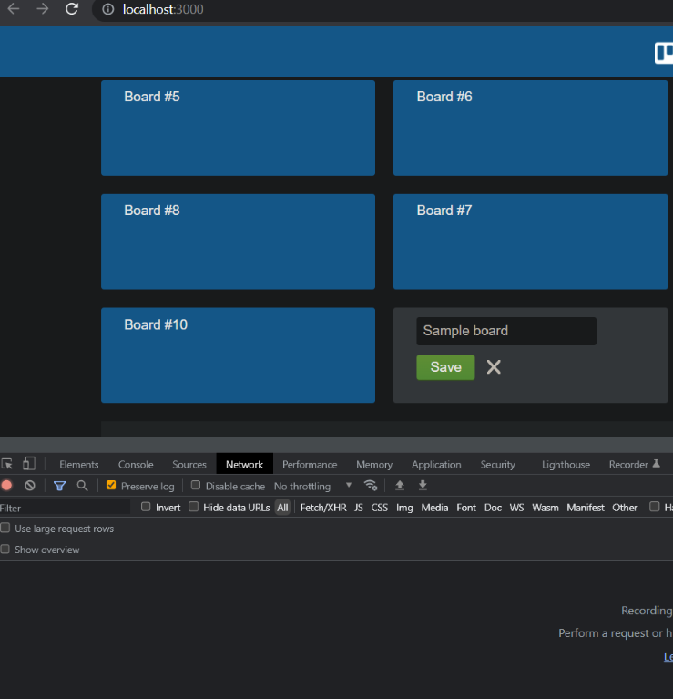
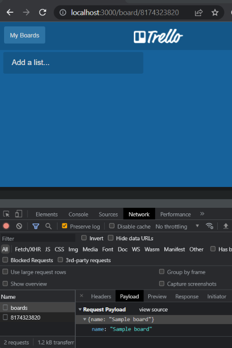

# Using cy.task and fixtures files
## What are we trying to accomplish
- Database seeding at the node level using static data provided from our fixture files.  Need to set the state of our application prior to test execution.  Our scenario requires that each test starts with 10 boards each with its own list.  
- We will be using **[cy.task](https://docs.cypress.io/api/commands/task#Syntax)** to run the code at the Node level as well as utilizing **[fixture files](https://docs.cypress.io/api/commands/fixture#Syntax)** to control the output of the API calls that will be responsible to create the data.  For this last part we'll be using **[Axios](https://axios-http.com/docs/intro)**.

- We have already covered a test bypassing login via UI by logging once via API in a before hook and setting the cookie named `trello_token` to the value from `body.accessToken`.  Afterwards, in a beforeEach hook we preserve the cookie for this test only using `Cypress.Cookies.preserveOnce` passing in the cookie name. 

As a reminder Cypress clears state in between tests and if we don't preserve the cookie any test blocks after the first one will fail being that this particular application relies on the cookie value to determine we're already logged in.

## Start building it
We want to be in full control of both board name and list name associated to each individual board.  For this, we make use of fixture files to mock our response.  But what goes in the fixture files and how do we mock that response?

- Go through the process of creating and saving a board but before hitting save open browser developer tools click on Network tab clear any results, now click save.  This will return the response and now we can take a look at the payload tab.  You can do a right click on the object select copy object.

    
- The object should be something similar to the following:

            
        {
        "name": "Sample board"
        }
- We want 10 boards so under fixtures files create a .json file similar to the one already created for this project called `tenBoards.json`.
Follow the same approach but this time inspecting the response that is returned when adding a list to a board and create a new fixture file similar to the one under fixtures folder for this project `oneListPerBoard.json`
- Finally, to make it easier to have access to both json objects and utilize any array method we want against that object, we declare two constants in our spec file to require the file path to the json file.  This allows us to access that object using cy.get (yourVarName) chaining a .then to access any item in the array as well as having access to any array methods to make any assertions.

## Implementing it
cy.task accepts any value that can be serialized by JSON.stringify(). and to pass multiple arguments such as in our case we need to use an object

This means that our variable assignments needs to be stringified so we can assign new variables to that conversion.

`const boards = require('../../fixtures/tenBoards.json');`
`const listBoards= require('../../fixtures/oneListPerBoard.json');`

Needs to be handled as follows:

`const JSONboards= JSON.stringify(boards);`
`const JSONlistBoards= JSON.stringify(listBoards);`

This allows us to pass both as an object
`cy.task('seedBoardData', {JSONboards, JSONlistBoards})`

- Our index.js file contains seedBoardData function where using Axios API sending a delete all boards request to start from a clean slate.  Then we parse each object save it as a new variable.  We iterate over the json object sending a post request to create the boards, once the boards are created we pass that object to a new function seedBoardLists were we also use Axios sending a post request that creates the list assigned to the board.

