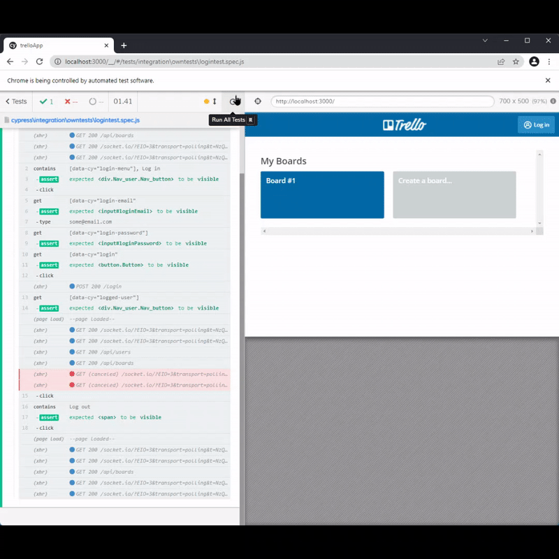
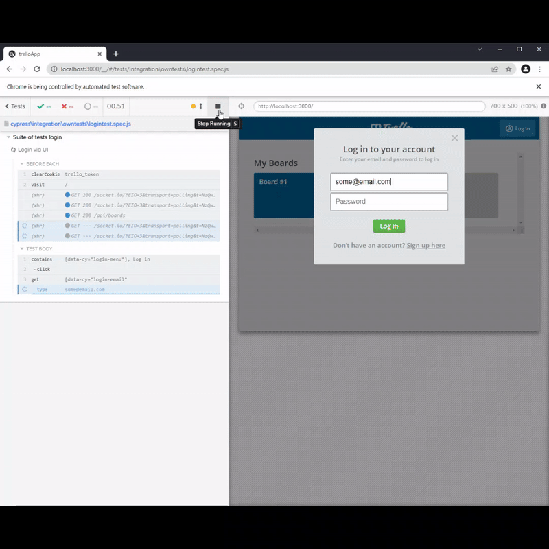

## Assertions 
- Discussing when is it necessary to asset after we query a DOM element taking into account some Cypress commands have built in assertions

    - By default the following commands have default assertions, meaning Cypress checks that the element is actionable before interacting with it.  Must be visible, not disabled or covered by another element.

    - Adding a `.should('be.visible')` as an additional check seems harmless and best practice but imagine having to do this for every command.  Not only is it time consuming but make Cypress test runner look very busy as it logs all the information.  All our assertions are in green, our login test goes through the flow of a login and logout in the same test.

        

    - For the next test I first make sure to clear the trello cookie so I can run the test multiple times, otherwise being that the test fails when you try to log out if you don't clear the cookie next time you run the test you will already have bypassed the login portion.  We want to see what happens now when we try to logout.

    

    - Our test fails it can't find the selector `[data-cy="logged-user"]` you can see the hidden symbol icon next to the selector and we have an error the element is detached from the DOM.  Also, notice that upon login there's a banner "User is logged in" and that is covering the button so we can logout of the test.

    - So we removed assertions and it failed, instead of adding the assertion back we can switch to using the command cy.contains passing as arguments the selector and text we expect to see.  We went from this

   ` cy.get('[data-cy="logged-user"]')
    .click();`

    to this

    `cy.contains('[data-cy="logged-user"]', 'some@email.com').click();`

    - It's always best practice to use a single query command instead of chaining and `contains` is a dual command that serves well.  Our final results.

    